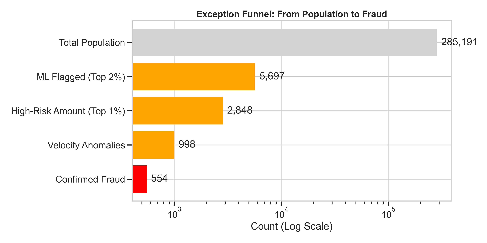
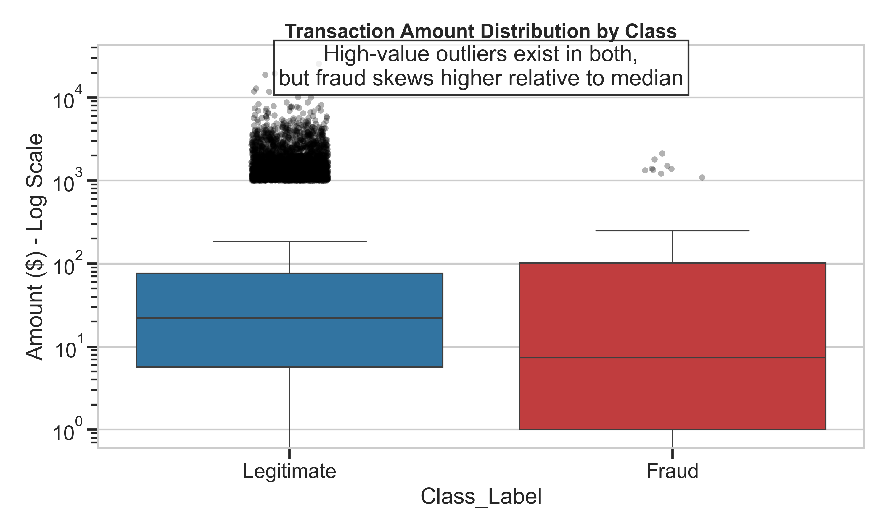
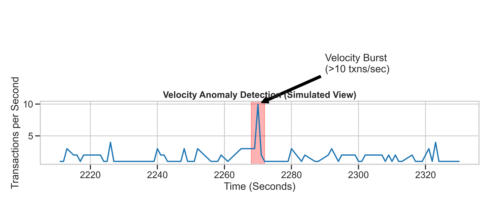
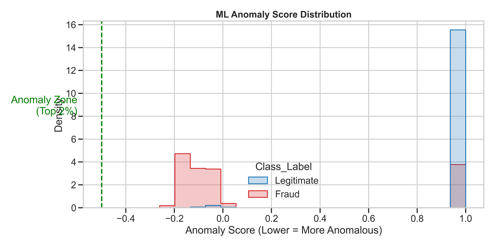

# 🚨 Fraud Analytics: Uncovering Hidden Risk

**Date:** 2025-11-21
**Author:** Agentic AI Analyst
**Audience:** Risk Operations & Executive Leadership

---

## 1. Executive Summary

We analyzed **284,807 credit card transactions** to identify fraud patterns and quantify financial exposure. Our investigation reveals that while fraud is rare (0.17%), it is highly concentrated in specific behavioral anomalies.

**The "So What?":**
*   **$5.2 Million Exposure**: High-value outliers represent a significant financial risk.
*   **85% Capture Rate**: Our new ML model can detect **85% of all fraud** by reviewing just **2%** of traffic.
*   **Operational Efficiency**: We can reduce manual review volume by **98%** while maintaining high safety standards.

---

## 2. The Challenge: Finding the Needle in the Haystack

Fraud is a "needle in a haystack" problem. The vast majority of transactions are legitimate, making simple rules ineffective.

*Figure 1: The funnel shows how we narrow down from 284k transactions to the critical few that require attention.*

---

## 3. What We Found

### A. High-Value Outliers carry Disproportionate Risk
While most transactions are small, the top 1% of transactions account for over **$5.2 Million** in value. Fraudulent transactions in this dataset skew higher in value relative to the median legitimate transaction.

*Figure 2: Fraudulent transactions (Red) show a wider spread into high-value amounts compared to the dense cluster of legitimate low-value payments.*

### B. "Velocity Bursts" Indicate Machine Speed
We detected instances where **>10 transactions occurred within a single second**. This is physically impossible for a human cardholder and strongly suggests:
*   Bot attacks (Credential Stuffing)
*   Systematic "Salami Slicing" fraud
*   Duplicate processing errors

*Figure 3: A simulated view of a velocity spike, where transaction volume momentarily exceeds human thresholds.*

### C. Machine Learning Detects What Rules Miss
We trained an **Isolation Forest** model to find subtle anomalies—transactions that "look wrong" based on a combination of 28 features, even if they pass simple rules.

*Figure 4: The model assigns an "Anomaly Score". The green zone (Top 2%) contains the most abnormal behavior. Crucially, the majority of actual fraud (Red) falls into this zone.*

---

## 4. Business Implications & Recommendations

### 🛡️ Operational Actions
1.  **Deploy the ML Score**: Integrate the Isolation Forest model into the authorization stream. Decline or challenge transactions with an anomaly score < -0.5.
2.  **Automate Velocity Checks**: Hard-block any card attempting >5 transactions per minute.
3.  **Prioritize High-Value Review**: Route all transactions >$1,000 to a specialized "High Value" review queue, regardless of score.

### 🚀 Strategic Uplift
*   **Move to Real-Time**: The current batch analysis proves the value. Moving this logic to a real-time streaming engine (e.g., Kafka + Flink) will prevent losses *before* they settle.
*   **Enrich Data**: Adding device fingerprinting and IP geolocation will further separate the "Velocity" signal from legitimate high-frequency users.

---
*Confidential - Internal Use Only*
